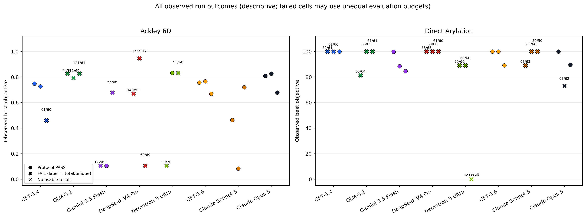
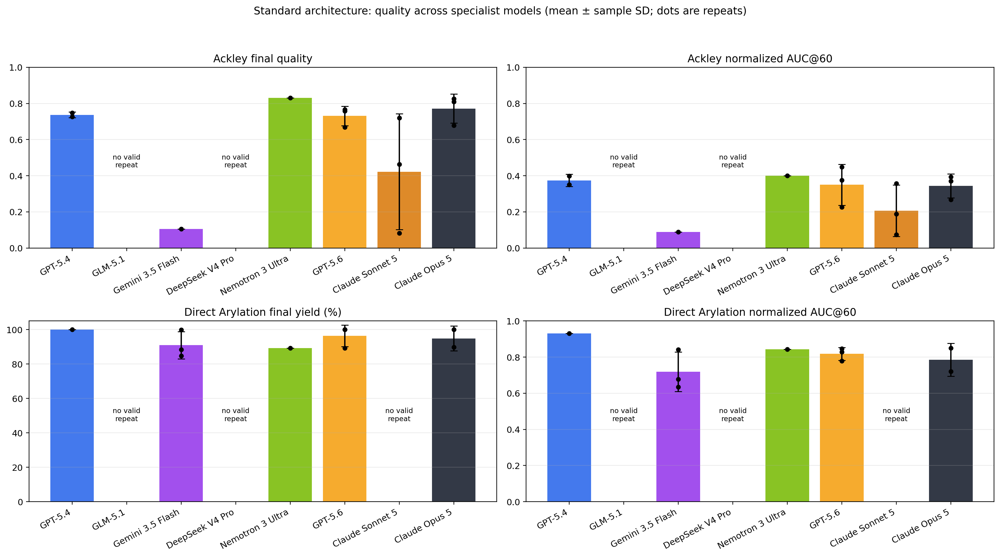
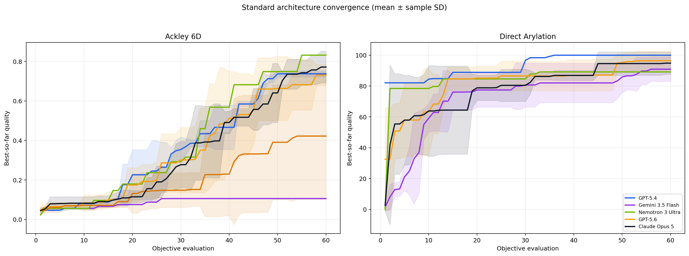
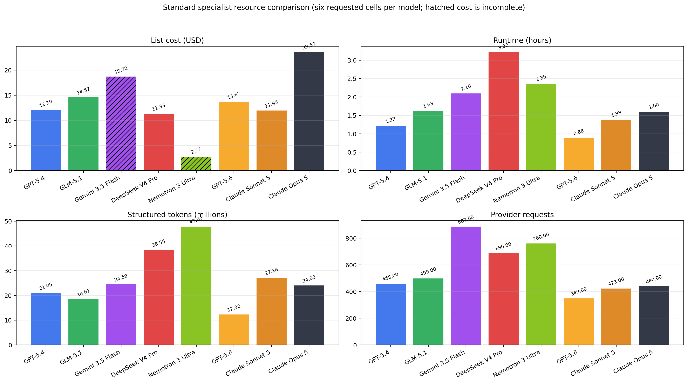
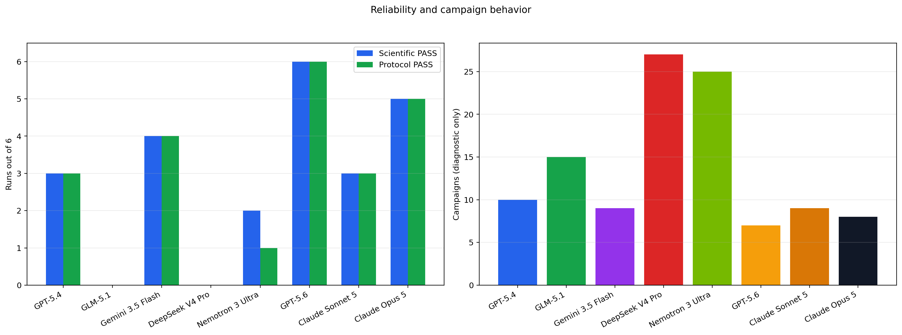
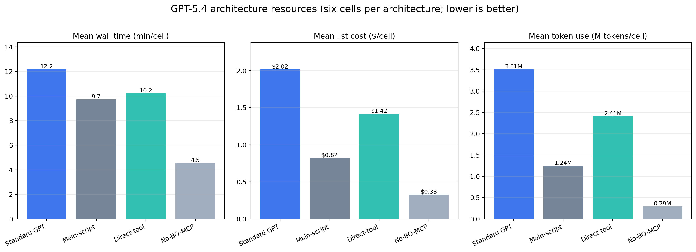
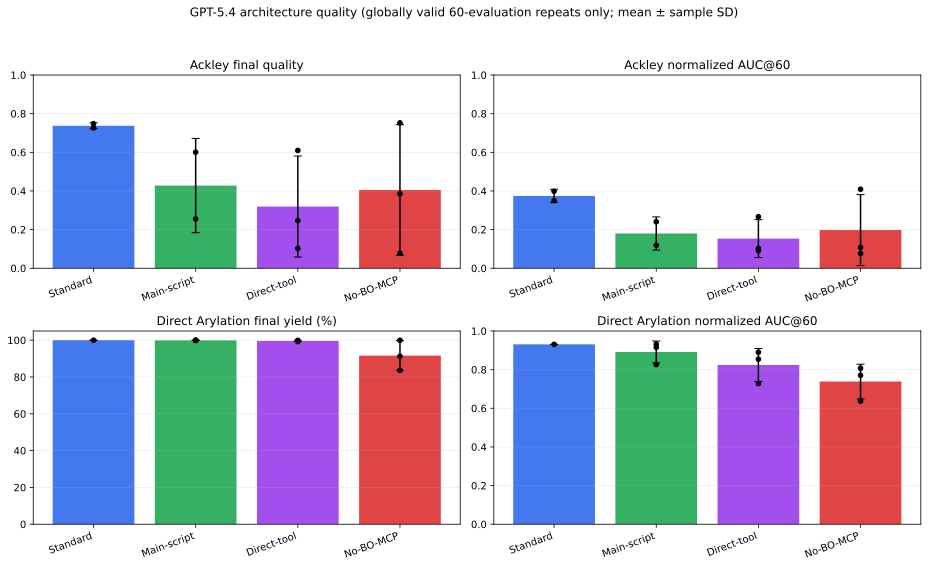

# Full framework comparison: verified final report

Generated: `2026-08-07T13:10:22.805746+00:00`

## Scope and interpretation

This report covers both benchmark cases (Ackley 6D and Direct Arylation), all eight specialist models under the Standard architecture, and GPT-5.4 under four architectures. Each requested cell has a budget of exactly 60 objective evaluations and three repeats per case. A model or agent failure is retained as an outcome; a replacement is used only where benchmark infrastructure—not model behavior—was defective.

Every run's observed best result is shown, including failed, over-budget, under-budget, duplicate, timeout, and architecture-invalid runs. `Budget PASS` means exactly 60 attempted objective evaluations in total. `Scientific PASS` additionally requires completed, unique benchmark-objective evaluations with the expected objective schema and backend and a complete result-derived trajectory. `Architecture PASS` means the intended main-agent/specialist ownership and required artifacts were preserved. `Protocol PASS` requires all three plus the artifact checks. Campaign count is descriptive only: one or several owned campaigns are allowed.

## Standard architecture aggregate comparison

| Specialist | Ackley final | Ackley AUC | Direct final | Direct AUC | Scientific | Protocol | Cost | Time (h) | Tokens (M) |
|---|---:|---:|---:|---:|---:|---:|---:|---:|---:|
| GPT-5.4 | 0.737 | 0.374 | 100.00 | 0.931 | 3/6 | 3/6 | $12.10 exact | 1.22 | 21.05 |
| GLM-5.1 | N/A | N/A | N/A | N/A | 0/6 | 0/6 | $14.57 exact | 1.63 | 18.61 |
| Gemini 3.5 Flash | 0.106 | 0.089 | 90.95 | 0.718 | 4/6 | 4/6 | $18.72 lower bound | 2.10 | 24.59 |
| DeepSeek V4 Pro | N/A | N/A | N/A | N/A | 0/6 | 0/6 | $11.33 exact | 3.22 | 38.55 |
| Nemotron 3 Ultra | 0.832 | 0.400 | 89.17 | 0.844 | 2/6 | 1/6 | $2.77 unavailable | 2.35 | 47.83 |
| GPT-5.6 | 0.731 | 0.350 | 96.39 | 0.817 | 6/6 | 6/6 | $13.67 exact | 0.88 | 12.32 |
| Claude Sonnet 5 | 0.422 | 0.207 | N/A | N/A | 3/6 | 3/6 | $11.95 exact | 1.38 | 27.18 |
| Claude Opus 5 | 0.772 | 0.344 | 94.84 | 0.785 | 5/6 | 5/6 | $23.57 exact | 1.60 | 24.03 |

### All observed outcomes

This descriptive figure includes every run with a retained result, regardless of evaluation count. `X` markers are failed protocol cells and are annotated as `total/unique`; their values are outcomes, not equal-budget estimates.

### Equal-budget quality comparison

The following quality, AUC, and convergence figures use only protocol-comparable 60-evaluation trajectories. Failed runs remain visible in the all-outcomes figure and per-run tables below.

## Every requested Standard run

### Ackley 6D

| Model | Rep | Observed best | AUC@60 | Eval/unique | Campaigns | Architecture | Status / special case | Source | Cost | Time (s) |
|---|---:|---:|---:|---:|---:|---|---|---|---:|---:|
| GPT | 1 | 0.748 | 0.350 | 60/60 | 1 | PASS | PASS | earlier matrix | $1.722 | 771.4 |
| GPT | 2 | 0.726 | 0.398 | 60/60 | 1 | PASS | PASS | earlier matrix | $2.340 | 839.0 |
| GPT | 3 | 0.460 | 0.146‡ | 61/60 | 2 | PASS | FAIL: budget 61; unique 60; duplicates 1 | earlier matrix | $1.462 | 575.7 |
| GLM | 1 | 0.827 | 0.411‡ | 63/60 | 2 | PASS | FAIL: budget 63; unique 60; duplicates 3 | earlier matrix | $2.289 | 1048.4 |
| GLM | 2 | 0.792 | 0.394‡ | 111/60 | 2 | PASS | FAIL: budget 111; unique 60; duplicates 51 | earlier matrix | $2.374 | 1133.4 |
| GLM | 3 | 0.827 | 0.411‡ | 121/61 | 2 | PASS | FAIL: budget 121; unique 61; duplicates 60 | earlier matrix | $1.606 | 840.2 |
| Gemini | 1 | 0.106 | 0.089‡ | 122/60 | 3 | PASS | FAIL: budget 122; unique 60; duplicates 62 | earlier matrix | $4.256† | 1653.6 |
| Gemini | 2 | 0.106 | 0.089 | 60/60 | 1 | PASS | PASS | earlier matrix | $2.195† | 754.1 |
| Gemini | 3 | 0.677 | 0.667‡ | 66/66 | 2 | FAIL | FAIL: budget 66; architecture | earlier matrix | $1.041† | 1672.4 |
| DeepSeek V4 Pro | 1 | 0.668 | N/A | 149/93 | 8 | PASS | FAIL: budget 149; unique 93; duplicates 56; timeout | 2026-08-07 replacement | $2.086 | 3626.9 |
| DeepSeek V4 Pro | 2 | 0.948 | 0.520‡ | 178/117 | 5 | PASS | FAIL: budget 178; unique 117; duplicates 61 | 2026-08-07 replacement | $1.510 | 2595.6 |
| DeepSeek V4 Pro | 3 | 0.106 | 0.104‡ | 69/69 | 5 | PASS | FAIL: budget 69 | 2026-08-07 replacement | $1.396 | 1906.1 |
| Nemotron | 1 | 0.106 | 0.090‡ | 90/70 | 10 | FAIL | FAIL: budget 90; unique 70; duplicates 20; architecture | earlier matrix | $0.784† | 2796.1 |
| Nemotron | 2 | 0.832 | 0.400 | 60/60 | 1 | PASS | PASS | earlier matrix | $1.185† | 2219.6 |
| Nemotron | 3 | 0.832 | 0.400‡ | 93/60 | 2 | PASS | FAIL: budget 93; unique 60; duplicates 33 | earlier matrix | $0.300† | 1070.6 |
| GPT-5.6 | 1 | 0.757 | 0.376 | 60/60 | 1 | PASS | PASS | earlier matrix | $1.232 | 397.5 |
| GPT-5.6 | 2 | 0.766 | 0.448 | 60/60 | 1 | PASS | PASS | earlier matrix | $2.426 | 489.4 |
| GPT-5.6 | 3 | 0.669 | 0.226 | 60/60 | 1 | PASS | PASS | earlier matrix | $2.319 | 468.5 |
| Claude Sonnet 5 | 1 | 0.463 | 0.189 | 60/60 | 1 | PASS | PASS | 2026-08-07 replacement | $1.451 | 603.6 |
| Claude Sonnet 5 | 2 | 0.083 | 0.074 | 60/60 | 1 | PASS | PASS | 2026-08-07 replacement | $3.702 | 1143.2 |
| Claude Sonnet 5 | 3 | 0.720 | 0.358 | 60/60 | 1 | PASS | PASS | 2026-08-07 replacement | $1.725 | 755.8 |
| Claude Opus 5 | 1 | 0.809 | 0.371 | 60/60 | 1 | PASS | PASS | 2026-08-07 replacement | $2.387 | 693.1 |
| Claude Opus 5 | 2 | 0.826 | 0.393 | 60/60 | 1 | PASS | PASS | 2026-08-07 replacement | $3.030 | 677.5 |
| Claude Opus 5 | 3 | 0.679 | 0.268 | 60/60 | 1 | PASS | PASS | 2026-08-07 replacement | $9.416 | 2471.1 |

### Direct Arylation

| Model | Rep | Observed best | AUC@60 | Eval/unique | Campaigns | Architecture | Status / special case | Source | Cost | Time (s) |
|---|---:|---:|---:|---:|---:|---|---|---|---:|---:|
| GPT | 1 | 100.000 | 0.960‡ | 62/61 | 3 | PASS | FAIL: budget 62; unique 61; duplicates 1 | earlier matrix | $2.071 | 639.6 |
| GPT | 2 | 99.810 | 0.932‡ | 61/60 | 2 | PASS | FAIL: budget 61; unique 60; duplicates 1 | earlier matrix | $3.233 | 1031.0 |
| GPT | 3 | 100.000 | 0.931 | 60/60 | 1 | PASS | PASS | earlier matrix | $1.267 | 520.2 |
| GLM | 1 | 81.480 | 0.686‡ | 65/64 | 4 | PASS | FAIL: budget 65; unique 64; duplicates 1 | earlier matrix | $2.286 | 715.5 |
| GLM | 2 | 100.000 | 0.785‡ | 66/65 | 3 | PASS | FAIL: budget 66; unique 65; duplicates 1 | earlier matrix | $4.473 | 1364.4 |
| GLM | 3 | 100.000 | 0.945‡ | 61/61 | 2 | PASS | FAIL: budget 61 | earlier matrix | $1.539 | 757.3 |
| Gemini | 1 | 99.810 | 0.842 | 60/60 | 1 | PASS | PASS | earlier matrix | $3.231† | 935.2 |
| Gemini | 2 | 88.410 | 0.678 | 60/60 | 1 | PASS | PASS | earlier matrix | $3.193† | 1042.3 |
| Gemini | 3 | 84.620 | 0.635 | 60/60 | 1 | PASS | PASS | earlier matrix | $4.807† | 1496.1 |
| DeepSeek | 1 | 100.000 | 0.910‡ | 63/63 | 3 | PASS | FAIL: budget 63 | earlier matrix | $2.214 | 863.3 |
| DeepSeek | 2 | 100.000 | 0.918‡ | 68/68 | 4 | PASS | FAIL: budget 68 | earlier matrix | $2.565 | 1320.9 |
| DeepSeek | 3 | 100.000 | 0.916‡ | 61/60 | 2 | PASS | FAIL: budget 61; unique 60; duplicates 1 | earlier matrix | $1.561 | 1273.2 |
| Nemotron | 1 | 89.170 | 0.844‡ | 75/60 | 3 | PASS | FAIL: budget 75; unique 60; duplicates 15 | earlier matrix | $0.265† | 1692.3 |
| Nemotron | 2 | 89.170 | 0.844 | 60/60 | 1 | FAIL | FAIL: architecture | earlier matrix | $0.236† | 696.2 |
| Nemotron | 3 | N/A | N/A | 6/2 | 8 | FAIL | FAIL: budget 6; unique 2; duplicates 4; architecture; backend; timeout | earlier matrix | $0.000† | 0.0 |
| GPT-5.6 | 1 | 100.000 | 0.778 | 60/60 | 1 | PASS | PASS | earlier matrix | $2.404 | 533.2 |
| GPT-5.6 | 2 | 100.000 | 0.827 | 60/60 | 2 | PASS | PASS | earlier matrix | $2.503 | 544.0 |
| GPT-5.6 | 3 | 89.170 | 0.847 | 60/60 | 1 | PASS | PASS | 2026-08-07 replacement | $2.784 | 747.6 |
| Claude Sonnet 5 | 1 | 89.170 | 0.696‡ | 63/63 | 3 | PASS | FAIL: budget 63 | 2026-08-07 replacement | $1.693 | 1007.0 |
| Claude Sonnet 5 | 2 | 100.000 | 0.744‡ | 63/60 | 2 | PASS | FAIL: budget 63; unique 60; duplicates 3 | 2026-08-07 replacement | $1.581 | 685.6 |
| Claude Sonnet 5 | 3 | 100.000 | N/A | 59/59 | 1 | PASS | FAIL: budget 59 | 2026-08-07 replacement | $1.796 | 779.9 |
| Claude Opus 5 | 1 | 99.980 | 0.721 | 60/60 | 1 | PASS | PASS | 2026-08-07 replacement | $3.121 | 675.2 |
| Claude Opus 5 | 2 | 73.080 | 0.588‡ | 63/62 | 3 | PASS | FAIL: budget 63; unique 62; duplicates 1 | 2026-08-07 replacement | $2.881 | 632.7 |
| Claude Opus 5 | 3 | 89.710 | 0.849 | 60/60 | 1 | PASS | PASS | 2026-08-07 replacement | $2.732 | 615.1 |

The dagger on a cell cost denotes a lower bound or unavailable total. A double dagger (`‡`) on AUC marks a retained descriptive/canonical AUC from a failed unequal-budget run; it is not used in equal-budget aggregates. Failed cells' observed best results, time, and measurable resources remain included in the all-results tables.

### Why evaluation counts differ from 60

There are 25 budget-invalid Standard cells: 18 are from the earlier matrix and 7 are from the 2026-08-07 replacement cohort. 23 exceeded 60 evaluations and 2 stopped below 60. One additional cell has exactly 60 evaluations but fails architecture compliance. The main cause of small overruns was an instruction inconsistency: the architecture contract requested a one-iteration objective smoke test before the “full” campaign, while the benchmark contract required exactly 60 total evaluations. The evaluator correctly counted the smoke and production campaigns together, but the prompt did not explicitly say to resume the smoke campaign and run only the remaining 59. Larger overruns and duplicates also reflect agent retries or repeated campaigns.

The future-run prompt preserves the bounded smoke-test step while stating that every objective evaluation performed during smoke testing, debugging, or repeated execution counts toward the same total. BO-MCP still does not impose a hard global cap because doing so would hide model budget-adherence behavior; the evaluator records and flags any future violation.

### Protocol failures and retained agent/model outcomes

| Model | Case | Rep | Failure classification | Evidence |
|---|---|---:|---|---|
| GPT | Ackley 6D | 3 | scientific, global-budget | results=61, unique=60, duplicates=1, campaigns=2 |
| GPT | Direct Arylation | 1 | scientific, global-budget | results=62, unique=61, duplicates=1, campaigns=3 |
| GPT | Direct Arylation | 2 | scientific, global-budget | results=61, unique=60, duplicates=1, campaigns=2 |
| GLM | Ackley 6D | 1 | scientific, global-budget | results=63, unique=60, duplicates=3, campaigns=2 |
| GLM | Ackley 6D | 2 | scientific, global-budget | results=111, unique=60, duplicates=51, campaigns=2 |
| GLM | Ackley 6D | 3 | scientific, global-budget | results=121, unique=61, duplicates=60, campaigns=2 |
| GLM | Direct Arylation | 1 | scientific, global-budget | results=65, unique=64, duplicates=1, campaigns=4 |
| GLM | Direct Arylation | 2 | scientific, global-budget | results=66, unique=65, duplicates=1, campaigns=3 |
| GLM | Direct Arylation | 3 | scientific, global-budget | results=61, unique=61, duplicates=0, campaigns=2 |
| Gemini | Ackley 6D | 1 | scientific, global-budget | results=122, unique=60, duplicates=62, campaigns=3 |
| Gemini | Ackley 6D | 3 | scientific, global-budget, architecture | results=66, unique=66, duplicates=0, campaigns=2 |
| DeepSeek V4 Pro | Ackley 6D | 1 | scientific, global-budget | AgentRunTimeout: complete agent run exceeded 3600s |
| DeepSeek V4 Pro | Ackley 6D | 2 | scientific, global-budget | results=178, unique=117, duplicates=61, campaigns=5 |
| DeepSeek V4 Pro | Ackley 6D | 3 | scientific, global-budget | results=69, unique=69, duplicates=0, campaigns=5 |
| DeepSeek | Direct Arylation | 1 | scientific, global-budget | results=63, unique=63, duplicates=0, campaigns=3 |
| DeepSeek | Direct Arylation | 2 | scientific, global-budget | results=68, unique=68, duplicates=0, campaigns=4 |
| DeepSeek | Direct Arylation | 3 | scientific, global-budget | results=61, unique=60, duplicates=1, campaigns=2 |
| Nemotron | Ackley 6D | 1 | scientific, global-budget, architecture | results=90, unique=70, duplicates=20, campaigns=10 |
| Nemotron | Ackley 6D | 3 | scientific, global-budget | results=93, unique=60, duplicates=33, campaigns=2 |
| Nemotron | Direct Arylation | 1 | scientific, global-budget | results=75, unique=60, duplicates=15, campaigns=3 |
| Nemotron | Direct Arylation | 2 | architecture | results=60, unique=60, duplicates=0, campaigns=1 |
| Nemotron | Direct Arylation | 3 | scientific, global-budget, architecture, backend | results=6, unique=2, duplicates=4, campaigns=8 |
| Claude Sonnet 5 | Direct Arylation | 1 | scientific, global-budget | results=63, unique=63, duplicates=0, campaigns=3 |
| Claude Sonnet 5 | Direct Arylation | 2 | scientific, global-budget | results=63, unique=60, duplicates=3, campaigns=2 |
| Claude Sonnet 5 | Direct Arylation | 3 | scientific, global-budget | results=59, unique=59, duplicates=0, campaigns=1 |
| Claude Opus 5 | Direct Arylation | 2 | scientific, global-budget | results=63, unique=62, duplicates=1, campaigns=3 |

## Four-architecture comparison (GPT-5.4)

| Architecture | Ackley final/AUC | Direct final/AUC | Science | Protocol | Cost | Time (h) | Tokens (M) |
|---|---:|---:|---:|---:|---:|---:|---:|
| Standard | 0.737/0.374 | 100.00/0.931 | 3/6 | 3/6 | $12.10 | 1.22 | 21.05 |
| Main-script | 0.428/0.180 | 99.94/0.891 | 5/6 | 5/6 | $4.94 | 0.97 | 7.46 |
| Direct-tool | 0.319/0.153 | 99.61/0.824 | 6/6 | 6/6 | $8.51 | 1.02 | 14.47 |
| No-BO-MCP | 0.405/0.198 | 91.62/0.739 | 6/6 | 6/6 | $1.96 | 0.45 | 1.76 |

### Every architecture repeat

| Architecture | Case | Rep | Observed best | AUC@60 | Eval/unique | Campaigns | Architecture | Status / special case |
|---|---|---:|---:|---:|---:|---:|---|---|
| Standard | Direct Arylation | 1 | 100.000 | 0.960‡ | 62/61 | 3 | PASS | FAIL: budget 62; unique 61 |
| Standard | Direct Arylation | 2 | 99.810 | 0.932‡ | 61/60 | 2 | PASS | FAIL: budget 61; unique 60 |
| Standard | Direct Arylation | 3 | 100.000 | 0.931 | 60/60 | 1 | PASS | PASS |
| Main-script | Direct Arylation | 1 | 100.000 | 0.827 | 60/60 | 7 | PASS | PASS |
| Main-script | Direct Arylation | 2 | 100.000 | 0.915 | 60/60 | 1 | PASS | PASS |
| Main-script | Direct Arylation | 3 | 99.810 | 0.932 | 60/60 | 1 | PASS | PASS |
| Direct-tool | Direct Arylation | 1 | 99.220 | 0.728 | 60/60 | 1 | PASS | PASS |
| Direct-tool | Direct Arylation | 2 | 99.810 | 0.890 | 60/60 | 1 | PASS | PASS |
| Direct-tool | Direct Arylation | 3 | 99.810 | 0.854 | 60/60 | 1 | PASS | PASS |
| No-BO-MCP | Direct Arylation | 1 | 99.980 | 0.808 | 60/60 | 0 | PASS | PASS |
| No-BO-MCP | Direct Arylation | 2 | 91.270 | 0.771 | 60/60 | 0 | PASS | PASS |
| No-BO-MCP | Direct Arylation | 3 | 83.620 | 0.637 | 60/60 | 0 | PASS | PASS |
| Standard | Ackley 6D | 1 | 0.748 | 0.350 | 60/60 | 1 | PASS | PASS |
| Standard | Ackley 6D | 2 | 0.726 | 0.398 | 60/60 | 1 | PASS | PASS |
| Standard | Ackley 6D | 3 | 0.460 | 0.146‡ | 61/60 | 2 | PASS | FAIL: budget 61; unique 60 |
| Main-script | Ackley 6D | 1 | 0.509 | 0.156‡ | 66/60 | 2 | PASS | FAIL: budget 66; unique 60 |
| Main-script | Ackley 6D | 2 | 0.255 | 0.119 | 60/60 | 1 | PASS | PASS |
| Main-script | Ackley 6D | 3 | 0.600 | 0.240 | 60/60 | 1 | PASS | PASS |
| Direct-tool | Ackley 6D | 1 | 0.246 | 0.102 | 60/60 | 1 | PASS | PASS |
| Direct-tool | Ackley 6D | 2 | 0.102 | 0.091 | 60/60 | 1 | PASS | PASS |
| Direct-tool | Ackley 6D | 3 | 0.610 | 0.266 | 60/60 | 1 | PASS | PASS |
| No-BO-MCP | Ackley 6D | 1 | 0.386 | 0.108 | 60/60 | 0 | PASS | PASS |
| No-BO-MCP | Ackley 6D | 2 | 0.077 | 0.076 | 60/60 | 0 | PASS | PASS |
| No-BO-MCP | Ackley 6D | 3 | 0.752 | 0.409 | 60/60 | 0 | PASS | PASS |

The architecture comparison uses the same two cases and three repeats. Standard delegates campaign authorship to the BO specialist and has the main agent execute it; Main-script has the main agent author/execute; Direct-tool exposes BO operations directly; No-BO-MCP removes BO-MCP and uses local optimization. The retained per-run architecture rows and trajectories are in `control/REPORT_DATA.json`.

## Cost completeness audit

Across all 66 model/architecture cells, 54 are exact under the frozen benchmark-date list-price schedule, 6 are lower bounds, and 6 are unavailable. “Exact” means every recorded billed response has usage and a matching frozen public/list price; it is not the account invoice after credits, discounts, routing fees, or taxes. Nemotron remains unavailable because its hosted endpoint has no authoritative public USD/token rate. A genuine timeout can remain a lower bound if cancellation leaves a provider request with unresolved billing.

| Arm | Case | Rep | Status | Known list cost | Calls | Missing/unresolved | Duplicates removed | Reason |
|---|---|---:|---|---:|---:|---:|---:|---|
| Direct-tool | Direct Arylation | 1 | exact_calculated | $1.4317 | 46 | 0 | 0 | complete ledger and frozen price |
| Direct-tool | Direct Arylation | 2 | exact_calculated | $1.3715 | 50 | 0 | 0 | complete ledger and frozen price |
| Direct-tool | Direct Arylation | 3 | exact_calculated | $1.3654 | 43 | 0 | 0 | complete ledger and frozen price |
| Direct-tool | Ackley 6D | 1 | exact_calculated | $1.4830 | 26 | 0 | 0 | complete ledger and frozen price |
| Direct-tool | Ackley 6D | 2 | exact_calculated | $1.5052 | 39 | 0 | 0 | complete ledger and frozen price |
| Direct-tool | Ackley 6D | 3 | exact_calculated | $1.3562 | 35 | 0 | 0 | complete ledger and frozen price |
| Main-script | Direct Arylation | 1 | exact_calculated | $0.9901 | 38 | 0 | 0 | complete ledger and frozen price |
| Main-script | Direct Arylation | 2 | exact_calculated | $0.9107 | 24 | 0 | 0 | complete ledger and frozen price |
| Main-script | Direct Arylation | 3 | exact_calculated | $0.7578 | 27 | 0 | 0 | complete ledger and frozen price |
| Main-script | Ackley 6D | 1 | exact_calculated | $0.6649 | 20 | 0 | 0 | complete ledger and frozen price |
| Main-script | Ackley 6D | 2 | exact_calculated | $0.8966 | 31 | 0 | 0 | complete ledger and frozen price |
| Main-script | Ackley 6D | 3 | exact_calculated | $0.7152 | 21 | 0 | 0 | complete ledger and frozen price |
| No-BO-MCP | Direct Arylation | 1 | exact_calculated | $0.2694 | 10 | 0 | 0 | complete ledger and frozen price |
| No-BO-MCP | Direct Arylation | 2 | exact_calculated | $0.3923 | 15 | 0 | 0 | complete ledger and frozen price |
| No-BO-MCP | Direct Arylation | 3 | exact_calculated | $0.3647 | 16 | 0 | 0 | complete ledger and frozen price |
| No-BO-MCP | Ackley 6D | 1 | exact_calculated | $0.2809 | 14 | 0 | 0 | complete ledger and frozen price |
| No-BO-MCP | Ackley 6D | 2 | exact_calculated | $0.2879 | 12 | 0 | 0 | complete ledger and frozen price |
| No-BO-MCP | Ackley 6D | 3 | exact_calculated | $0.3668 | 17 | 0 | 0 | complete ledger and frozen price |
| DeepSeek V4 Pro | Direct Arylation | 1 | exact_calculated | $2.2139 | 79 | 0 | 0 | complete ledger and frozen price |
| DeepSeek V4 Pro | Direct Arylation | 2 | exact_calculated | $2.5649 | 99 | 0 | 0 | complete ledger and frozen price |
| DeepSeek V4 Pro | Direct Arylation | 3 | exact_calculated | $1.5613 | 76 | 0 | 0 | complete ledger and frozen price |
| DeepSeek V4 Pro | Ackley 6D | 1 | exact_calculated | $2.0858 | 156 | 0 | 0 | complete ledger and frozen price |
| DeepSeek V4 Pro | Ackley 6D | 2 | exact_calculated | $1.5105 | 135 | 0 | 0 | complete ledger and frozen price |
| DeepSeek V4 Pro | Ackley 6D | 3 | exact_calculated | $1.3959 | 141 | 0 | 0 | complete ledger and frozen price |
| Gemini 3.5 Flash | Direct Arylation | 1 | lower_bound | $3.2312 | 108 | 2 | 49 | usage or authoritative price unavailable |
| Gemini 3.5 Flash | Direct Arylation | 2 | lower_bound | $3.1931 | 122 | 16 | 55 | usage or authoritative price unavailable |
| Gemini 3.5 Flash | Direct Arylation | 3 | lower_bound | $4.8068 | 172 | 35 | 81 | usage or authoritative price unavailable |
| Gemini 3.5 Flash | Ackley 6D | 1 | lower_bound | $4.2561 | 148 | 5 | 66 | usage or authoritative price unavailable |
| Gemini 3.5 Flash | Ackley 6D | 2 | lower_bound | $2.1954 | 80 | 4 | 0 | usage or authoritative price unavailable |
| Gemini 3.5 Flash | Ackley 6D | 3 | lower_bound | $1.0408 | 257 | 208 | 0 | usage or authoritative price unavailable |
| GLM-5.1 | Direct Arylation | 1 | exact_calculated | $2.2862 | 72 | 0 | 0 | complete ledger and frozen price |
| GLM-5.1 | Direct Arylation | 2 | exact_calculated | $4.4726 | 120 | 0 | 74 | complete ledger and frozen price |
| GLM-5.1 | Direct Arylation | 3 | exact_calculated | $1.5392 | 60 | 0 | 0 | complete ledger and frozen price |
| GLM-5.1 | Ackley 6D | 1 | exact_calculated | $2.2887 | 83 | 0 | 0 | complete ledger and frozen price |
| GLM-5.1 | Ackley 6D | 2 | exact_calculated | $2.3739 | 83 | 0 | 0 | complete ledger and frozen price |
| GLM-5.1 | Ackley 6D | 3 | exact_calculated | $1.6061 | 81 | 0 | 0 | complete ledger and frozen price |
| GPT-5.4 | Direct Arylation | 1 | exact_calculated | $2.0710 | 78 | 0 | 0 | complete ledger and frozen price |
| GPT-5.4 | Direct Arylation | 2 | exact_calculated | $3.2334 | 120 | 0 | 32 | complete ledger and frozen price |
| GPT-5.4 | Direct Arylation | 3 | exact_calculated | $1.2674 | 47 | 0 | 0 | complete ledger and frozen price |
| GPT-5.4 | Ackley 6D | 1 | exact_calculated | $1.7219 | 65 | 0 | 0 | complete ledger and frozen price |
| GPT-5.4 | Ackley 6D | 2 | exact_calculated | $2.3404 | 89 | 0 | 24 | complete ledger and frozen price |
| GPT-5.4 | Ackley 6D | 3 | exact_calculated | $1.4621 | 59 | 0 | 0 | complete ledger and frozen price |
| GPT-5.6 | Direct Arylation | 1 | exact_calculated | $2.4038 | 61 | 0 | 0 | complete ledger and frozen price |
| GPT-5.6 | Direct Arylation | 2 | exact_calculated | $2.5031 | 64 | 0 | 0 | complete ledger and frozen price |
| GPT-5.6 | Direct Arylation | 3 | exact_calculated | $2.7842 | 73 | 0 | 0 | complete ledger and frozen price |
| GPT-5.6 | Ackley 6D | 1 | exact_calculated | $1.2321 | 44 | 0 | 0 | complete ledger and frozen price |
| GPT-5.6 | Ackley 6D | 2 | exact_calculated | $2.4263 | 58 | 0 | 0 | complete ledger and frozen price |
| GPT-5.6 | Ackley 6D | 3 | exact_calculated | $2.3188 | 49 | 0 | 0 | complete ledger and frozen price |
| Nemotron 3 Ultra | Direct Arylation | 1 | unavailable | $0.2655 | 108 | 1 | 0 | traced_provider_without_public_usd_price; unavailable |
| Nemotron 3 Ultra | Direct Arylation | 2 | unavailable | $0.2359 | 50 | 1 | 0 | traced_provider_without_public_usd_price; unavailable |
| Nemotron 3 Ultra | Direct Arylation | 3 | unavailable | $0.0000 | 249 | 55 | 680 | traced_provider_without_public_usd_price; unavailable |
| Nemotron 3 Ultra | Ackley 6D | 1 | unavailable | $0.7836 | 170 | 2 | 308 | traced_provider_without_public_usd_price; unavailable |
| Nemotron 3 Ultra | Ackley 6D | 2 | unavailable | $1.1854 | 100 | 45 | 0 | traced_provider_without_public_usd_price |
| Nemotron 3 Ultra | Ackley 6D | 3 | unavailable | $0.3004 | 83 | 1 | 0 | traced_provider_without_public_usd_price; unavailable |
| Claude Opus 5 | Direct Arylation | 1 | exact_calculated | $3.1210 | 64 | 0 | 0 | complete ledger and frozen price |
| Claude Opus 5 | Direct Arylation | 2 | exact_calculated | $2.8814 | 55 | 0 | 0 | complete ledger and frozen price |
| Claude Opus 5 | Direct Arylation | 3 | exact_calculated | $2.7324 | 56 | 0 | 0 | complete ledger and frozen price |
| Claude Opus 5 | Ackley 6D | 1 | exact_calculated | $2.3873 | 50 | 0 | 0 | complete ledger and frozen price |
| Claude Opus 5 | Ackley 6D | 2 | exact_calculated | $3.0298 | 65 | 0 | 0 | complete ledger and frozen price |
| Claude Opus 5 | Ackley 6D | 3 | exact_calculated | $9.4161 | 150 | 0 | 0 | complete ledger and frozen price |
| Claude Sonnet 5 | Direct Arylation | 1 | exact_calculated | $1.6928 | 63 | 0 | 0 | complete ledger and frozen price |
| Claude Sonnet 5 | Direct Arylation | 2 | exact_calculated | $1.5807 | 54 | 0 | 0 | complete ledger and frozen price |
| Claude Sonnet 5 | Direct Arylation | 3 | exact_calculated | $1.7956 | 57 | 0 | 0 | complete ledger and frozen price |
| Claude Sonnet 5 | Ackley 6D | 1 | exact_calculated | $1.4506 | 50 | 0 | 0 | complete ledger and frozen price |
| Claude Sonnet 5 | Ackley 6D | 2 | exact_calculated | $3.7016 | 142 | 0 | 0 | complete ledger and frozen price |
| Claude Sonnet 5 | Ackley 6D | 3 | exact_calculated | $1.7248 | 57 | 0 | 0 | complete ledger and frozen price |

## Corrected infrastructure and replacement policy

The replacement cohort uses an append-only provider ledger, response-ID deduplication, frozen pricing, a read-only runtime with writable output/tmp areas, Claude’s explicit response allowance, local-only benchmark tools, Gemini-compatible tool-response conversion, BayBE for future runs, lightweight diagnostics readback, and unambiguous shared-budget smoke-test instructions. The 16 selected replacements are enumerated with hashes in `control/SELECTION_AUDIT.json`. Initial infrastructure-aborted pilots are preserved but excluded. Failed tasks, retries, timeouts, extra campaigns, duplicate evaluations, and budget overruns are retained as observed outcomes and clearly marked; runs affected by the former smoke/full-budget wording are not described as pure model failures.

## Reproducibility

`control/REPORT_DATA.json` stores every plotted trajectory and all per-run rows. `control/FULL_COST_AUDIT.json` stores the 66-cell call/usage/cost reconciliation. `control/SELECTION_AUDIT.json` identifies replaced evidence and why. `control/benchmark_cost_rules_2026-08-06.json` freezes list-price rules. `control/REPORT_MANIFEST.sha256` hashes the report, data, audits, figures, and every selected replacement output.
