# Full framework comparison: verified final report

Generated: `2026-08-08T02:01:59.199569+00:00`

## Scope and interpretation

This report covers both benchmark cases (Ackley 6D and Direct Arylation), all eight specialist models under the Standard architecture, and GPT-5.4 under four architectures. Each requested cell has a budget of exactly 60 objective evaluations and three repeats per case. A model or agent failure is retained as an outcome; a replacement is used only where benchmark infrastructure—not model behavior—was defective.

Every run's observed best result is shown, including failed, over-budget, under-budget, duplicate, timeout, and architecture-invalid runs. `Budget PASS` means exactly 60 attempted objective evaluations in total. `Scientific PASS` additionally requires completed, unique benchmark-objective evaluations with the expected objective schema and backend and a complete result-derived trajectory. `Architecture PASS` means the intended main-agent/specialist ownership and required artifacts were preserved. `Protocol PASS` requires all three plus the artifact checks. Campaign count is descriptive only: one or several owned campaigns are allowed.

## Standard architecture aggregate comparison

| Specialist | Ackley final | Ackley AUC | Direct final | Direct AUC | Scientific | Protocol | Workflow cost | Time (h) | Tokens (M) |
|---|---:|---:|---:|---:|---:|---:|---:|---:|---:|
| GPT-5.4 | 0.770 | 0.442 | 100.00 | 0.865 | 6/6 | 6/6 | $9.66 exact | 1.10 | 16.29 |
| GLM-5.1 | 0.363 | 0.259 | 98.88 | 0.790 | 6/6 | 6/6 | $9.12 exact | 2.01 | 28.37 |
| Gemini 3.5 Flash | 0.397 | 0.204 | 92.21 | 0.637 | 6/6 | 6/6 | $39.84 exact | 1.84 | 44.59 |
| DeepSeek V4 Pro | 0.566 | 0.212 | 73.11 | 0.623 | 4/6 | 4/6 | $5.54 exact | 2.85 | 36.71 |
| Nemotron 3 Ultra | 0.690 | 0.273 | 89.17 | 0.844 | 3/6 | 2/6 | $3.10 lower bound | 2.55 | 50.27 |
| GPT-5.6 | 0.731 | 0.350 | 96.39 | 0.817 | 6/6 | 6/6 | $13.67 exact | 0.88 | 12.32 |
| Claude Sonnet 5 | 0.422 | 0.207 | 100.00 | 0.933 | 5/6 | 5/6 | $12.19 exact | 1.80 | 28.12 |
| Claude Opus 5 | 0.772 | 0.344 | 94.84 | 0.785 | 5/6 | 5/6 | $23.57 exact | 1.60 | 23.84 |

`Workflow cost` is the combined Standard workflow cost, including the GPT-5.4 main agent and the specialist. The Nemotron specialist endpoint itself costs $0; Nemotron's displayed workflow cost is paid GPT-5.4 main-agent usage, with one retained lower-bound cell where that paid usage was not preserved.

### Interpreting low Ackley repeats

The low Ackley observations are verified end-to-end outcomes, not missing data: each comparable cell has 60 unique evaluations, the requested BayBE backend, matching objective values, and a complete trajectory. Ackley 6D remains difficult at this budget, and the agent-authored BO configuration materially affects the result. GLM-5.1 repeats 1 and 2 independently selected the same deterministic configuration (seed 42, initial design 12, expected improvement) and therefore produced identical trajectories. Gemini repeats 2 and 3 likewise selected seed 42, initial design 10, and automatic acquisition and produced identical trajectories. These pairs measure reproducibility of the agent's configuration choice, but they are not independent optimizer-randomness draws. Sonnet repeat 2 is a valid low trajectory amid two materially stronger repeats; Nemotron's two valid Ackley repeats also differ substantially. No replacement is warranted unless the experimental question is changed to externally assigned, distinct seeds rather than end-to-end agent-selected workflows.

### All observed outcomes

This descriptive figure includes every run with a retained result, regardless of evaluation count. `X` markers are failed protocol cells and are annotated as `total/unique`; their values are outcomes, not equal-budget estimates.

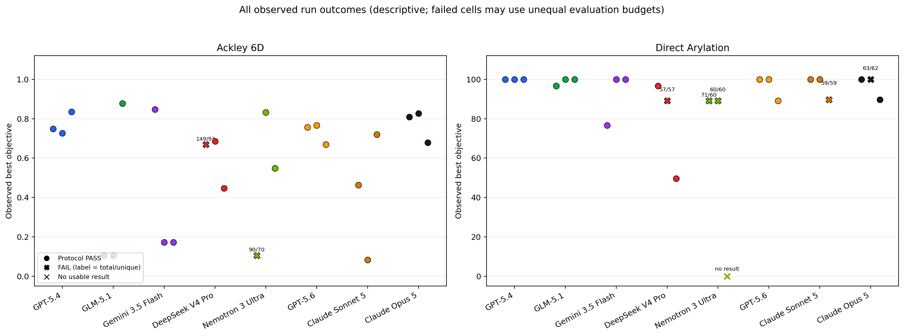

### Equal-budget quality comparison

The following quality, AUC, and convergence figures use only protocol-comparable 60-evaluation trajectories. Failed runs remain visible in the all-outcomes figure and per-run tables below.

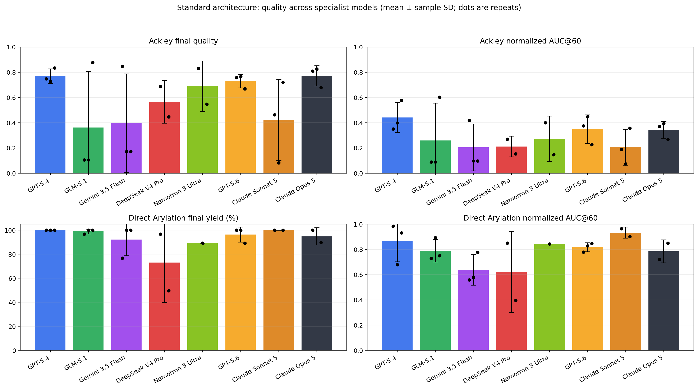

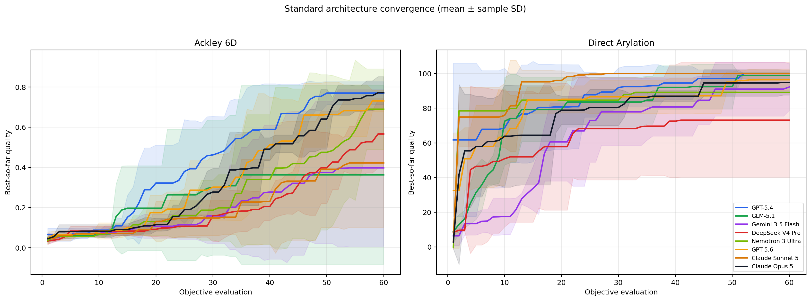

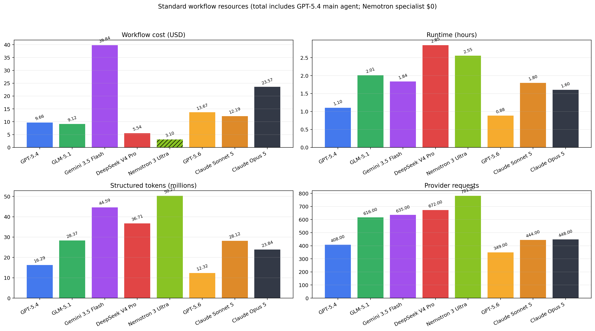

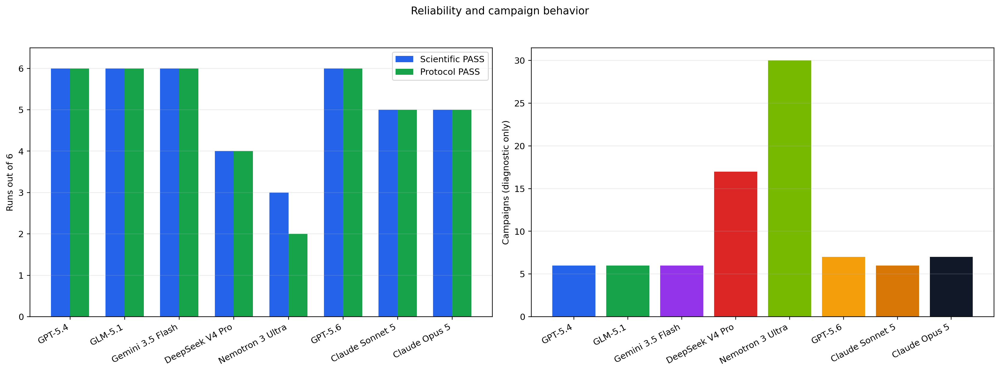

## Every requested Standard run

### Ackley 6D

| Model | Rep | Observed best | AUC@60 | Eval/unique | Campaigns | Architecture | Status / special case | Source | Cost | Time (s) |
|---|---:|---:|---:|---:|---:|---|---|---|---:|---:|
| GPT-5.4 | 1 | 0.748 | 0.350 | 60/60 | 1 | PASS | PASS | earlier matrix | $1.722 | 771.4 |
| GPT-5.4 | 2 | 0.726 | 0.398 | 60/60 | 1 | PASS | PASS | earlier matrix | $2.340 | 839.0 |
| GPT-5.4 | 3 | 0.835 | 0.577 | 60/60 | 1 | PASS | PASS | BayBE duplicate-fix replacement | $1.281 | 510.2 |
| GLM-5.1 | 1 | 0.105 | 0.088 | 60/60 | 1 | PASS | PASS | prompt-clarified replacement | $2.645 | 2873.2 |
| GLM-5.1 | 2 | 0.105 | 0.088 | 60/60 | 1 | PASS | PASS | prompt-clarified replacement | $2.793 | 1929.2 |
| GLM-5.1 | 3 | 0.877 | 0.602 | 60/60 | 1 | PASS | PASS | BayBE duplicate-fix replacement | $1.633 | 1020.7 |
| Gemini 3.5 Flash | 1 | 0.848 | 0.418 | 60/60 | 1 | PASS | PASS | infrastructure replacement | $13.705 | 1516.3 |
| Gemini 3.5 Flash | 2 | 0.172 | 0.097 | 60/60 | 1 | PASS | PASS | infrastructure replacement | $7.057 | 1572.0 |
| Gemini 3.5 Flash | 3 | 0.172 | 0.097 | 60/60 | 1 | PASS | PASS | prompt-clarified replacement | $4.102 | 887.4 |
| DeepSeek V4 Pro | 1 | 0.668 | N/A | 149/93 | 8 | PASS | FAIL: budget 149; unique 93; duplicates 56; timeout | infrastructure replacement | $2.086 | 3626.9 |
| DeepSeek V4 Pro | 2 | 0.686 | 0.270 | 60/60 | 2 | PASS | PASS | prompt-clarified replacement | $0.416 | 571.9 |
| DeepSeek V4 Pro | 3 | 0.446 | 0.154 | 60/60 | 1 | PASS | PASS | prompt-clarified replacement | $1.067 | 1964.2 |
| Nemotron 3 Ultra | 1 | 0.106 | 0.090‡ | 90/70 | 10 | FAIL | FAIL: budget 90; unique 70; duplicates 20; architecture | earlier matrix | $0.784 | 2796.1 |
| Nemotron 3 Ultra | 2 | 0.832 | 0.400 | 60/60 | 1 | PASS | PASS | earlier matrix | $1.185 | 2219.6 |
| Nemotron 3 Ultra | 3 | 0.548 | 0.146 | 60/60 | 2 | PASS | PASS; 60 unique objective evaluations; one valid result remained local after an invalid BO-MCP submission payload (59 submitted) | BayBE duplicate-fix replacement | $0.545 | 1458.2 |
| GPT-5.6 | 1 | 0.757 | 0.376 | 60/60 | 1 | PASS | PASS | earlier matrix | $1.232 | 397.5 |
| GPT-5.6 | 2 | 0.766 | 0.448 | 60/60 | 1 | PASS | PASS | earlier matrix | $2.426 | 489.4 |
| GPT-5.6 | 3 | 0.669 | 0.226 | 60/60 | 1 | PASS | PASS | earlier matrix | $2.319 | 468.5 |
| Claude Sonnet 5 | 1 | 0.463 | 0.189 | 60/60 | 1 | PASS | PASS | infrastructure replacement | $1.451 | 603.6 |
| Claude Sonnet 5 | 2 | 0.083 | 0.074 | 60/60 | 1 | PASS | PASS | infrastructure replacement | $3.702 | 1143.2 |
| Claude Sonnet 5 | 3 | 0.720 | 0.358 | 60/60 | 1 | PASS | PASS | infrastructure replacement | $1.725 | 755.8 |
| Claude Opus 5 | 1 | 0.809 | 0.371 | 60/60 | 1 | PASS | PASS | infrastructure replacement | $2.387 | 693.1 |
| Claude Opus 5 | 2 | 0.826 | 0.393 | 60/60 | 1 | PASS | PASS | infrastructure replacement | $3.030 | 677.5 |
| Claude Opus 5 | 3 | 0.679 | 0.268 | 60/60 | 1 | PASS | PASS | infrastructure replacement | $9.416 | 2471.1 |

### Direct Arylation

| Model | Rep | Observed best | AUC@60 | Eval/unique | Campaigns | Architecture | Status / special case | Source | Cost | Time (s) |
|---|---:|---:|---:|---:|---:|---|---|---|---:|---:|
| GPT-5.4 | 1 | 100.000 | 0.984 | 60/60 | 1 | PASS | PASS | prompt-clarified replacement | $1.481 | 622.0 |
| GPT-5.4 | 2 | 100.000 | 0.679 | 60/60 | 1 | PASS | PASS | prompt-clarified replacement | $1.565 | 715.0 |
| GPT-5.4 | 3 | 100.000 | 0.931 | 60/60 | 1 | PASS | PASS | earlier matrix | $1.267 | 520.2 |
| GLM-5.1 | 1 | 96.640 | 0.728 | 60/60 | 1 | PASS | PASS | prompt-clarified replacement | $0.832 | 535.2 |
| GLM-5.1 | 2 | 100.000 | 0.892 | 60/60 | 1 | PASS | PASS | prompt-clarified replacement | $0.694 | 494.2 |
| GLM-5.1 | 3 | 100.000 | 0.750 | 60/60 | 1 | PASS | PASS | prompt-clarified replacement | $0.518 | 378.0 |
| Gemini 3.5 Flash | 1 | 76.630 | 0.558 | 60/60 | 1 | PASS | PASS | infrastructure replacement | $4.251 | 1147.7 |
| Gemini 3.5 Flash | 2 | 100.000 | 0.577 | 60/60 | 1 | PASS | PASS | prompt-clarified replacement | $4.757 | 650.8 |
| Gemini 3.5 Flash | 3 | 100.000 | 0.777 | 60/60 | 1 | PASS | PASS | infrastructure replacement | $5.964 | 832.8 |
| DeepSeek V4 Pro | 1 | 96.640 | 0.850 | 60/60 | 1 | PASS | PASS | prompt-clarified replacement | $0.456 | 967.9 |
| DeepSeek V4 Pro | 2 | 89.170 | N/A | 57/57 | 4 | PASS | FAIL: budget 57 | prompt-clarified replacement | $0.901 | 1650.3 |
| DeepSeek V4 Pro | 3 | 49.570 | 0.395 | 60/60 | 1 | PASS | PASS | prompt-clarified replacement | $0.620 | 1477.4 |
| Nemotron 3 Ultra | 1 | 89.170 | 0.824‡ | 71/60 | 8 | PASS | FAIL: budget 71; unique 60; duplicates 11 | prompt-clarified replacement | $0.351 | 2022.0 |
| Nemotron 3 Ultra | 2 | 89.170 | 0.844 | 60/60 | 1 | FAIL | FAIL: architecture | earlier matrix | $0.236 | 696.2 |
| Nemotron 3 Ultra | 3 | N/A | N/A | 6/2 | 8 | FAIL | FAIL: budget 6; unique 2; duplicates 4; architecture; backend; timeout | earlier matrix | $0.000† | 0.0 |
| GPT-5.6 | 1 | 100.000 | 0.778 | 60/60 | 1 | PASS | PASS | earlier matrix | $2.404 | 533.2 |
| GPT-5.6 | 2 | 100.000 | 0.827 | 60/60 | 2 | PASS | PASS | earlier matrix | $2.503 | 544.0 |
| GPT-5.6 | 3 | 89.170 | 0.847 | 60/60 | 1 | PASS | PASS | infrastructure replacement | $2.784 | 747.6 |
| Claude Sonnet 5 | 1 | 100.000 | 0.964 | 60/60 | 1 | PASS | PASS | prompt-clarified replacement | $1.817 | 648.8 |
| Claude Sonnet 5 | 2 | 100.000 | 0.902 | 60/60 | 1 | PASS | PASS | prompt-clarified replacement | $1.659 | 857.7 |
| Claude Sonnet 5 | 3 | 89.710 | N/A | 59/59 | 1 | PASS | FAIL: budget 59 | prompt-clarified replacement | $1.838 | 2459.1 |
| Claude Opus 5 | 1 | 99.980 | 0.721 | 60/60 | 1 | PASS | PASS | infrastructure replacement | $3.121 | 675.2 |
| Claude Opus 5 | 2 | 100.000 | 0.848‡ | 63/62 | 2 | PASS | FAIL: budget 63; unique 62; duplicates 1 | prompt-clarified replacement | $2.881 | 634.4 |
| Claude Opus 5 | 3 | 89.710 | 0.849 | 60/60 | 1 | PASS | PASS | infrastructure replacement | $2.732 | 615.1 |

The dagger on a cell cost denotes a lower bound or unavailable total. A double dagger (`‡`) on AUC marks a retained descriptive/canonical AUC from a failed unequal-budget run; it is not used in equal-budget aggregates. Failed cells' observed best results, time, and measurable resources remain included in the all-results tables.

### Why evaluation counts differ from 60

There are 7 budget-invalid Standard cells: 2 are retained from the earlier matrix, 1 comes from the infrastructure-replacement cohort, and 4 occurred under the clarified shared-budget prompt. 4 exceeded 60 evaluations and 3 stopped below 60. One additional cell has exactly 60 evaluations but fails architecture compliance. The prompt-clarified failures are retained as model/agent budget-adherence outcomes, not attributed to the former smoke/full-campaign ambiguity.

The corrected prompt preserves the bounded smoke-test step while stating that every objective evaluation performed during smoke testing, debugging, or repeated execution counts toward the same total. BO-MCP does not impose a hard global cap because doing so would hide model budget-adherence behavior; the evaluator records and flags violations.

The prior duplicate-affected Ackley r03 cells for GPT-5.4, GLM-5.1, and Nemotron were replaced after correcting BayBE continuous duplicate resuggestions. GPT-5.4 and GLM-5.1 each completed one 60-result campaign with zero duplicates. Nemotron performed 60 unique objective evaluations; its first valid result remained in the local immutable artifact after an invalid submission payload, and the other 59 were submitted to BO-MCP. The report includes all 60 in its scientific trajectory and marks this provenance explicitly.

### Protocol failures and retained agent/model outcomes

| Model | Case | Rep | Failure classification | Evidence |
|---|---|---:|---|---|
| DeepSeek V4 Pro | Ackley 6D | 1 | scientific, global-budget | AgentRunTimeout: complete agent run exceeded 3600s |
| DeepSeek V4 Pro | Direct Arylation | 2 | scientific, global-budget | results=57, unique=57, duplicates=0, campaigns=4 |
| Nemotron 3 Ultra | Ackley 6D | 1 | scientific, global-budget, architecture | results=90, unique=70, duplicates=20, campaigns=10 |
| Nemotron 3 Ultra | Direct Arylation | 1 | scientific, global-budget | results=71, unique=60, duplicates=11, campaigns=8 |
| Nemotron 3 Ultra | Direct Arylation | 2 | architecture | specialist executed the full 60-point production campaign; Standard requires the main agent to execute the specialist-authored script |
| Nemotron 3 Ultra | Direct Arylation | 3 | scientific, global-budget, architecture, backend | results=6, unique=2, duplicates=4, campaigns=8 |
| Claude Sonnet 5 | Direct Arylation | 3 | scientific, global-budget | results=59, unique=59, duplicates=0, campaigns=1 |
| Claude Opus 5 | Direct Arylation | 2 | scientific, global-budget | results=63, unique=62, duplicates=1, campaigns=2 |

## Four-architecture comparison (GPT-5.4)

| Architecture | Ackley final/AUC | Direct final/AUC | Science | Protocol | Cost | Time (h) | Tokens (M) |
|---|---:|---:|---:|---:|---:|---:|---:|
| Standard | 0.770/0.442 | 100.00/0.865 | 6/6 | 6/6 | $9.66 | 1.10 | 16.29 |
| Main-script | 0.557/0.265 | 99.94/0.891 | 6/6 | 6/6 | $4.97 | 0.85 | 7.43 |
| Direct-tool | 0.319/0.153 | 99.61/0.824 | 6/6 | 6/6 | $8.51 | 1.02 | 14.47 |
| No-BO-MCP | 0.405/0.198 | 91.62/0.739 | 6/6 | 6/6 | $1.96 | 0.45 | 1.76 |

### Every architecture repeat

| Architecture | Case | Rep | Observed best | AUC@60 | Eval/unique | Campaigns | Architecture | Status / special case |
|---|---|---:|---:|---:|---:|---:|---|---|
| Standard | Direct Arylation | 1 | 100.000 | 0.984 | 60/60 | 1 | PASS | PASS |
| Standard | Direct Arylation | 2 | 100.000 | 0.679 | 60/60 | 1 | PASS | PASS |
| Standard | Direct Arylation | 3 | 100.000 | 0.931 | 60/60 | 1 | PASS | PASS |
| Main-script | Direct Arylation | 1 | 100.000 | 0.827 | 60/60 | 7 | PASS | PASS |
| Main-script | Direct Arylation | 2 | 100.000 | 0.915 | 60/60 | 1 | PASS | PASS |
| Main-script | Direct Arylation | 3 | 99.810 | 0.932 | 60/60 | 1 | PASS | PASS |
| Direct-tool | Direct Arylation | 1 | 99.220 | 0.728 | 60/60 | 1 | PASS | PASS |
| Direct-tool | Direct Arylation | 2 | 99.810 | 0.890 | 60/60 | 1 | PASS | PASS |
| Direct-tool | Direct Arylation | 3 | 99.810 | 0.854 | 60/60 | 1 | PASS | PASS |
| No-BO-MCP | Direct Arylation | 1 | 99.980 | 0.808 | 60/60 | 0 | PASS | PASS |
| No-BO-MCP | Direct Arylation | 2 | 91.270 | 0.771 | 60/60 | 0 | PASS | PASS |
| No-BO-MCP | Direct Arylation | 3 | 83.620 | 0.637 | 60/60 | 0 | PASS | PASS |
| Standard | Ackley 6D | 1 | 0.748 | 0.350 | 60/60 | 1 | PASS | PASS |
| Standard | Ackley 6D | 2 | 0.726 | 0.398 | 60/60 | 1 | PASS | PASS |
| Standard | Ackley 6D | 3 | 0.835 | 0.577 | 60/60 | 1 | PASS | PASS |
| Main-script | Ackley 6D | 1 | 0.814 | 0.436 | 60/60 | 1 | PASS | PASS |
| Main-script | Ackley 6D | 2 | 0.255 | 0.119 | 60/60 | 1 | PASS | PASS |
| Main-script | Ackley 6D | 3 | 0.600 | 0.240 | 60/60 | 1 | PASS | PASS |
| Direct-tool | Ackley 6D | 1 | 0.246 | 0.102 | 60/60 | 1 | PASS | PASS |
| Direct-tool | Ackley 6D | 2 | 0.102 | 0.091 | 60/60 | 1 | PASS | PASS |
| Direct-tool | Ackley 6D | 3 | 0.610 | 0.266 | 60/60 | 1 | PASS | PASS |
| No-BO-MCP | Ackley 6D | 1 | 0.386 | 0.108 | 60/60 | 0 | PASS | PASS |
| No-BO-MCP | Ackley 6D | 2 | 0.077 | 0.076 | 60/60 | 0 | PASS | PASS |
| No-BO-MCP | Ackley 6D | 3 | 0.752 | 0.409 | 60/60 | 0 | PASS | PASS |

The architecture comparison uses the same two cases and three repeats. Standard delegates campaign authorship to the BO specialist and has the main agent execute it; Main-script has the main agent author/execute; Direct-tool exposes BO operations directly; No-BO-MCP removes BO-MCP and uses local optimization. The retained per-run architecture rows and trajectories are in `control/REPORT_DATA.json`.

The earlier frozen matrix reported a higher Direct Arylation AUC for Standard than for Main-script (0.941 versus 0.891). However, Standard repeats 1 and 2 in that matrix performed 62 and 61 total objective evaluations, respectively, so that value is retained only as descriptive historical evidence. The current equal-budget Standard replacements produced AUCs of 0.984, 0.679, and 0.931 (mean 0.865; sample SD 0.163), while Main-script produced 0.827, 0.915, and 0.932 (mean 0.891; sample SD 0.057). The 0.027 mean difference is driven by one weak Standard repeat and is small relative to the observed run-to-run variation; these three repeats do not support a strong claim that either architecture has better Direct Arylation sample efficiency. Standard reached a mean final yield of 100.00 versus 99.94 for Main-script.

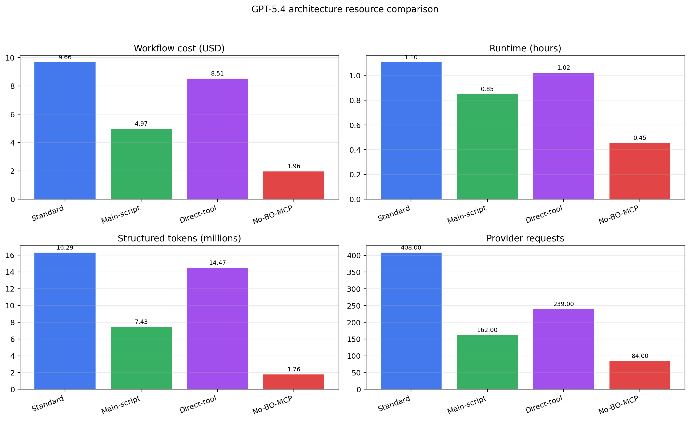

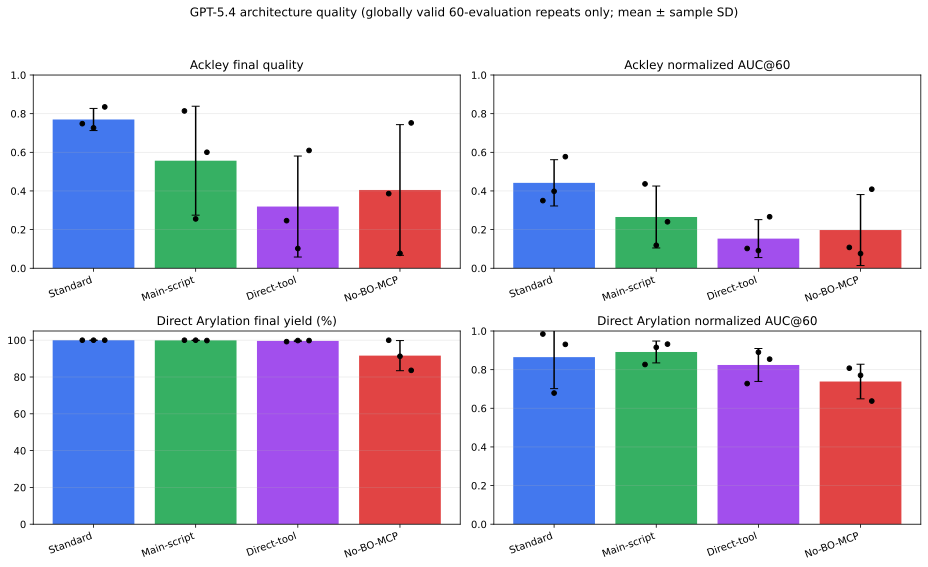

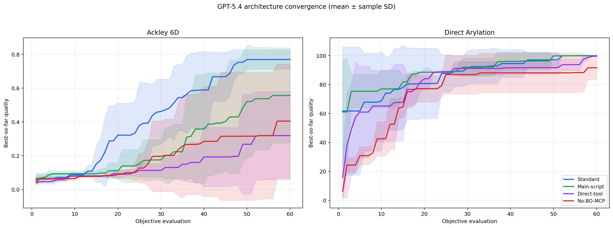

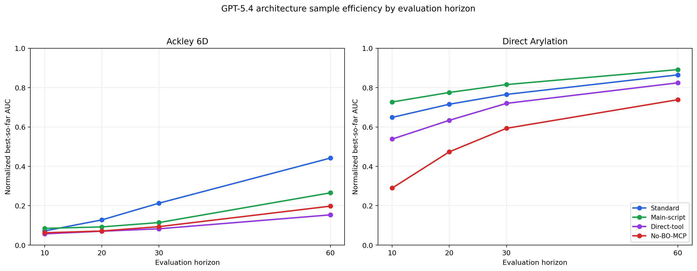

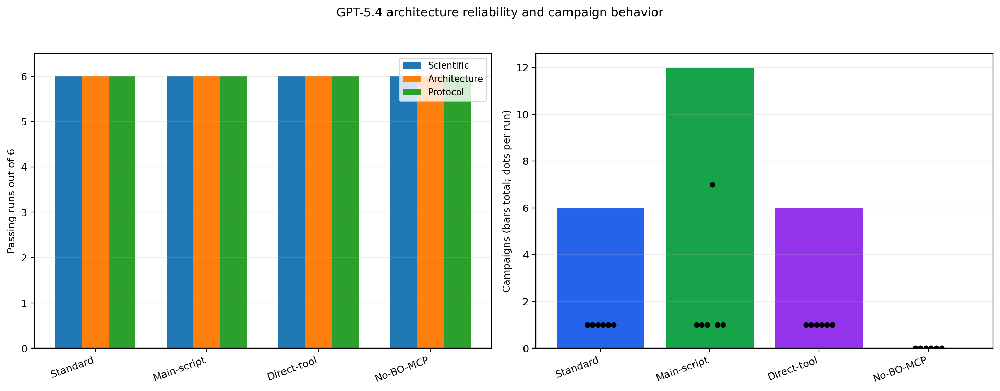

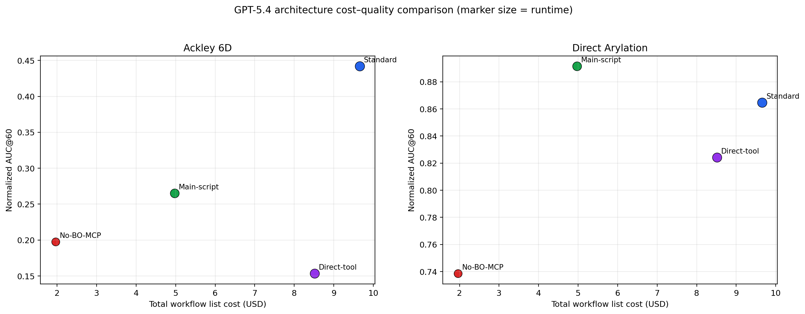

## Cost completeness audit

Across all 66 model/architecture cells, 65 are exact under the benchmark-date pricing schedule, 1 are lower bounds, and 0 are unavailable. “Exact” means every paid response has usage and a matching frozen public/list price. The Nemotron specialist cost is exactly $0 because these runs used NVIDIA's free developer endpoint; the displayed Nemotron workflow cost still includes the GPT-5.4 main agent. A genuine timeout can remain a lower bound if cancellation leaves a paid provider request with unresolved billing.

| Arm | Case | Rep | Status | Workflow cost | Calls | Missing/unresolved paid calls | Duplicates removed | Reason |
|---|---|---:|---|---:|---:|---:|---:|---|
| Direct-tool | Direct Arylation | 1 | exact_calculated | $1.4317 | 46 | 0 | 0 | complete ledger and frozen price |
| Direct-tool | Direct Arylation | 2 | exact_calculated | $1.3715 | 50 | 0 | 0 | complete ledger and frozen price |
| Direct-tool | Direct Arylation | 3 | exact_calculated | $1.3654 | 43 | 0 | 0 | complete ledger and frozen price |
| Direct-tool | Ackley 6D | 1 | exact_calculated | $1.4830 | 26 | 0 | 0 | complete ledger and frozen price |
| Direct-tool | Ackley 6D | 2 | exact_calculated | $1.5052 | 39 | 0 | 0 | complete ledger and frozen price |
| Direct-tool | Ackley 6D | 3 | exact_calculated | $1.3562 | 35 | 0 | 0 | complete ledger and frozen price |
| Main-script | Direct Arylation | 1 | exact_calculated | $0.9901 | 38 | 0 | 0 | complete ledger and frozen price |
| Main-script | Direct Arylation | 2 | exact_calculated | $0.9107 | 24 | 0 | 0 | complete ledger and frozen price |
| Main-script | Direct Arylation | 3 | exact_calculated | $0.7578 | 27 | 0 | 0 | complete ledger and frozen price |
| Main-script | Ackley 6D | 1 | exact_calculated | $0.7026 | 21 | 0 | 0 | complete ledger and frozen price |
| Main-script | Ackley 6D | 2 | exact_calculated | $0.8966 | 31 | 0 | 0 | complete ledger and frozen price |
| Main-script | Ackley 6D | 3 | exact_calculated | $0.7152 | 21 | 0 | 0 | complete ledger and frozen price |
| No-BO-MCP | Direct Arylation | 1 | exact_calculated | $0.2694 | 10 | 0 | 0 | complete ledger and frozen price |
| No-BO-MCP | Direct Arylation | 2 | exact_calculated | $0.3923 | 15 | 0 | 0 | complete ledger and frozen price |
| No-BO-MCP | Direct Arylation | 3 | exact_calculated | $0.3647 | 16 | 0 | 0 | complete ledger and frozen price |
| No-BO-MCP | Ackley 6D | 1 | exact_calculated | $0.2809 | 14 | 0 | 0 | complete ledger and frozen price |
| No-BO-MCP | Ackley 6D | 2 | exact_calculated | $0.2879 | 12 | 0 | 0 | complete ledger and frozen price |
| No-BO-MCP | Ackley 6D | 3 | exact_calculated | $0.3668 | 17 | 0 | 0 | complete ledger and frozen price |
| DeepSeek V4 Pro | Direct Arylation | 1 | exact_calculated | $0.4561 | 64 | 0 | 0 | complete ledger and frozen price |
| DeepSeek V4 Pro | Direct Arylation | 2 | exact_calculated | $0.9011 | 130 | 0 | 0 | complete ledger and frozen price |
| DeepSeek V4 Pro | Direct Arylation | 3 | exact_calculated | $0.6196 | 91 | 0 | 0 | complete ledger and frozen price |
| DeepSeek V4 Pro | Ackley 6D | 1 | exact_calculated | $2.0858 | 156 | 0 | 0 | complete ledger and frozen price |
| DeepSeek V4 Pro | Ackley 6D | 2 | exact_calculated | $0.4156 | 73 | 0 | 0 | complete ledger and frozen price |
| DeepSeek V4 Pro | Ackley 6D | 3 | exact_calculated | $1.0665 | 158 | 0 | 0 | complete ledger and frozen price |
| Gemini 3.5 Flash | Direct Arylation | 1 | exact_calculated | $4.2511 | 86 | 0 | 0 | complete ledger and frozen price |
| Gemini 3.5 Flash | Direct Arylation | 2 | exact_calculated | $4.7574 | 84 | 0 | 0 | complete ledger and frozen price |
| Gemini 3.5 Flash | Direct Arylation | 3 | exact_calculated | $5.9642 | 97 | 0 | 0 | complete ledger and frozen price |
| Gemini 3.5 Flash | Ackley 6D | 1 | exact_calculated | $13.7045 | 153 | 0 | 0 | complete ledger and frozen price |
| Gemini 3.5 Flash | Ackley 6D | 2 | exact_calculated | $7.0574 | 131 | 0 | 0 | complete ledger and frozen price |
| Gemini 3.5 Flash | Ackley 6D | 3 | exact_calculated | $4.1023 | 84 | 0 | 0 | complete ledger and frozen price |
| GLM-5.1 | Direct Arylation | 1 | exact_calculated | $0.8322 | 81 | 0 | 0 | complete ledger and frozen price |
| GLM-5.1 | Direct Arylation | 2 | exact_calculated | $0.6944 | 58 | 0 | 0 | complete ledger and frozen price |
| GLM-5.1 | Direct Arylation | 3 | exact_calculated | $0.5185 | 46 | 0 | 0 | complete ledger and frozen price |
| GLM-5.1 | Ackley 6D | 1 | exact_calculated | $2.6451 | 139 | 0 | 0 | complete ledger and frozen price |
| GLM-5.1 | Ackley 6D | 2 | exact_calculated | $2.7935 | 169 | 0 | 0 | complete ledger and frozen price |
| GLM-5.1 | Ackley 6D | 3 | exact_calculated | $1.6326 | 123 | 0 | 0 | complete ledger and frozen price |
| GPT-5.4 | Direct Arylation | 1 | exact_calculated | $1.4811 | 75 | 0 | 0 | complete ledger and frozen price |
| GPT-5.4 | Direct Arylation | 2 | exact_calculated | $1.5654 | 83 | 0 | 0 | complete ledger and frozen price |
| GPT-5.4 | Direct Arylation | 3 | exact_calculated | $1.2674 | 47 | 0 | 0 | complete ledger and frozen price |
| GPT-5.4 | Ackley 6D | 1 | exact_calculated | $1.7219 | 65 | 0 | 0 | complete ledger and frozen price |
| GPT-5.4 | Ackley 6D | 2 | exact_calculated | $2.3404 | 89 | 0 | 24 | complete ledger and frozen price |
| GPT-5.4 | Ackley 6D | 3 | exact_calculated | $1.2809 | 49 | 0 | 0 | complete ledger and frozen price |
| GPT-5.6 | Direct Arylation | 1 | exact_calculated | $2.4038 | 61 | 0 | 0 | complete ledger and frozen price |
| GPT-5.6 | Direct Arylation | 2 | exact_calculated | $2.5031 | 64 | 0 | 0 | complete ledger and frozen price |
| GPT-5.6 | Direct Arylation | 3 | exact_calculated | $2.7842 | 73 | 0 | 0 | complete ledger and frozen price |
| GPT-5.6 | Ackley 6D | 1 | exact_calculated | $1.2321 | 44 | 0 | 0 | complete ledger and frozen price |
| GPT-5.6 | Ackley 6D | 2 | exact_calculated | $2.4263 | 58 | 0 | 0 | complete ledger and frozen price |
| GPT-5.6 | Ackley 6D | 3 | exact_calculated | $2.3188 | 49 | 0 | 0 | complete ledger and frozen price |
| Nemotron 3 Ultra | Direct Arylation | 1 | exact_calculated | $0.3511 | 109 | 0 | 0 | GPT-5.4 list cost + Nemotron free endpoint ($0) |
| Nemotron 3 Ultra | Direct Arylation | 2 | exact_calculated | $0.2359 | 50 | 0 | 0 | GPT-5.4 list cost + Nemotron free endpoint ($0) |
| Nemotron 3 Ultra | Direct Arylation | 3 | lower_bound | $0.0000 | 249 | 50 | 680 | Nemotron free endpoint ($0); paid GPT-5.4 usage is incomplete |
| Nemotron 3 Ultra | Ackley 6D | 1 | exact_calculated | $0.7836 | 170 | 0 | 308 | GPT-5.4 list cost + Nemotron free endpoint ($0) |
| Nemotron 3 Ultra | Ackley 6D | 2 | exact_calculated | $1.1854 | 100 | 0 | 0 | GPT-5.4 list cost + Nemotron free endpoint ($0) |
| Nemotron 3 Ultra | Ackley 6D | 3 | exact_calculated | $0.5446 | 103 | 0 | 0 | GPT-5.4 list cost + Nemotron free endpoint ($0) |
| Claude Opus 5 | Direct Arylation | 1 | exact_calculated | $3.1210 | 64 | 0 | 0 | complete ledger and frozen price |
| Claude Opus 5 | Direct Arylation | 2 | exact_calculated | $2.8809 | 63 | 0 | 0 | complete ledger and frozen price |
| Claude Opus 5 | Direct Arylation | 3 | exact_calculated | $2.7324 | 56 | 0 | 0 | complete ledger and frozen price |
| Claude Opus 5 | Ackley 6D | 1 | exact_calculated | $2.3873 | 50 | 0 | 0 | complete ledger and frozen price |
| Claude Opus 5 | Ackley 6D | 2 | exact_calculated | $3.0298 | 65 | 0 | 0 | complete ledger and frozen price |
| Claude Opus 5 | Ackley 6D | 3 | exact_calculated | $9.4161 | 150 | 0 | 0 | complete ledger and frozen price |
| Claude Sonnet 5 | Direct Arylation | 1 | exact_calculated | $1.8169 | 67 | 0 | 0 | complete ledger and frozen price |
| Claude Sonnet 5 | Direct Arylation | 2 | exact_calculated | $1.6592 | 54 | 0 | 0 | complete ledger and frozen price |
| Claude Sonnet 5 | Direct Arylation | 3 | exact_calculated | $1.8379 | 74 | 0 | 0 | complete ledger and frozen price |
| Claude Sonnet 5 | Ackley 6D | 1 | exact_calculated | $1.4506 | 50 | 0 | 0 | complete ledger and frozen price |
| Claude Sonnet 5 | Ackley 6D | 2 | exact_calculated | $3.7016 | 142 | 0 | 0 | complete ledger and frozen price |
| Claude Sonnet 5 | Ackley 6D | 3 | exact_calculated | $1.7248 | 57 | 0 | 0 | complete ledger and frozen price |

## Corrected infrastructure and replacement policy

The replacement cohort uses an append-only provider ledger, response-ID deduplication, frozen pricing, a read-only runtime with writable output/tmp areas, Claude’s explicit response allowance, local-only benchmark tools, Gemini-compatible tool-response conversion, BayBE for future runs, lightweight diagnostics readback, and unambiguous shared-budget smoke-test instructions. The 37 selected replacements are enumerated with hashes in `control/SELECTION_AUDIT.json`. Initial infrastructure-aborted pilots are preserved but excluded. Failed tasks, retries, timeouts, extra campaigns, duplicate evaluations, and budget overruns are retained as observed outcomes and clearly marked; runs affected by the former smoke/full-budget wording are not described as pure model failures.

## Reproducibility

`control/REPORT_DATA.json` stores every plotted trajectory and all per-run rows. `control/FULL_COST_AUDIT.json` stores the 66-cell call/usage/cost reconciliation. `control/SELECTION_AUDIT.json` identifies replaced evidence and why. `control/benchmark_cost_rules_2026-08-06.json` freezes list-price rules. `control/REPORT_MANIFEST.sha256` hashes the report, data, audits, figures, and every selected replacement output.
